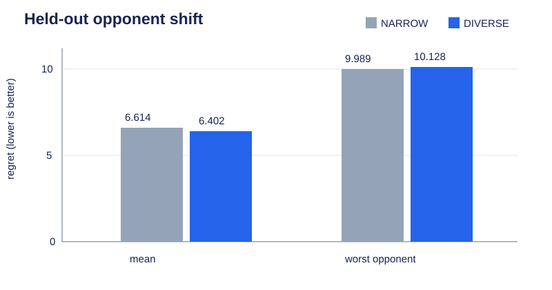
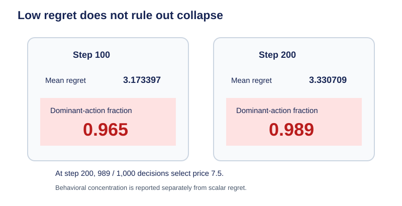

# Strategic LLM Agents

### Learning, simulation, and evaluation for strategic multi-agent policies

This repository studies learned agents in sequential strategic environments. It implements direct language-model policies, hierarchical language-model planning with a learned parameter-sharing IPPO controller, and local SFT/GRPO policies. The evaluation stack measures exact counterfactual regret, opponent shift, action collapse, sequential-history dependence, and behavior under lossless state transformations.

A recurring question is whether high benchmark performance reflects the interactive capability a task is intended to measure. Experiments therefore combine learned policies with executable simulators, exact evaluators, held-out opponent populations, intervention-based diagnostics, and established imperfect-information games.


*S2B shares actor/critic parameters across five decentralized agents; arrows describe execution paths, not comparative performance.*

## Multi-agent learning: the S2B controller

The learned hierarchical controller is the technical center of the project. Five agents interact simultaneously, independently sampling actions from one shared actor. Actor and critic parameters are shared, execution uses decentralized observations, every agent receives its own Pricing profit, and learning uses PPO with GAE. A semantic planner intent is appended to each agent's observation.

The concise public implementation is in [`agents/ippo_controller.py`](src/strategic_agents/agents/ippo_controller.py) and [`training/ippo.py`](src/strategic_agents/training/ippo.py); the full derivation and training evidence are in [`docs/multi_agent_learning.md`](docs/multi_agent_learning.md).

| Architecture | Strategic path |
|---|---|
| S1 direct | state/history → LLM → legal action |
| S2A hierarchical | state/history → LLM planner → intent → rule controller → action |
| **S2B learned MARL** | state/history → planner intent; decentralized state + intent → shared IPPO → per-agent actions |
| S3 local | state/history → SFT/GRPO-trained local LLM → action |

## Evaluation beyond reward

| Diagnostic | What it detects |
|---|---|
| Exact regret | unilateral action quality with opponents fixed |
| Held-out opponent shift | train/test population generalization |
| Worst opponent and CVaR | tail failures hidden by a mean |
| Entropy and dominant fraction | near-constant policy collapse |
| State/opponent conditioning | whether actions vary with strategic inputs |
| History interventions | behavioral dependence versus useful inference |



*DIVERSE improves the held-out mean modestly but slightly worsens the worst opponent; lower regret is better.*

Low regret alone proved insufficient: a competence-matched SmolLM3 policy reached mean regret 3.173397 at step 100 and 3.330709 at step 200 while becoming almost constant. At step 200, 989 of 1,000 actions selected price 7.5. This motivates reporting policy behavior alongside return and regret.

## Simulation and closed-loop evaluation

```text
human log:             s0 -> a0 -> s1 -> a1 -> s2
synthetic closed loop: s0 -> a0 -> s1 -> b1 -> ?
```

When `b1 != a1`, a logged human dataset does not supply the real counterpart response conditioned on that deviation. Teacher-forced next-action accuracy evaluates on-trajectory response modeling; it does not alone validate a recursively generated population. This unresolved issue emerged from the CraigslistBargain and Deal-or-No-Deal pipelines. See the prominent [`closed_loop_evaluation.md`](docs/closed_loop_evaluation.md) research note and executable support demo.

## Established imperfect-information games

The evaluation layer integrates OpenSpiel with Kuhn Poker and Leduc Poker, CFR+ reference policies, NashConv, legal-action handling, and exact/reference-policy continuation values where supported. The frozen Leduc audit enumerated 468 information states and 288 observations, including 180 multi-information-state observation groups. The 5,000-iteration CFR+ reference policy had NashConv approximately `3.677e-05`.

This is established-game evaluation infrastructure for testing strategic agents under partial observability, not a claim of a completed large benchmark. See [`imperfect_information_games.md`](docs/imperfect_information_games.md).

## Selected findings

### 1. Population diversity gives a modest average improvement — **MIXED**

DIVERSE reduced held-out mean regret from 6.614020 to 6.401803, approximately 3.21%; the paired opponent-stratified episode bootstrap CI for DIVERSE minus NARROW was [-0.358756, -0.048068]. Worst-opponent regret was slightly worse (10.128015 versus 9.989314), and the CVaR gain missed the stronger preregistered gate. Population diversity modestly improved average held-out performance but did not establish robust worst-case adaptation.

### 2. Scalar score can hide collapse

The SmolLM3 example above paired low regret with a 0.989 dominant-action fraction. The small matched architecture diagnostic also shows why behavior matters:

| Method | Reward | Mean regret | Dominant fraction | Entropy |
|---|---:|---:|---:|---:|
| S1 | 585.102577 | 69.400756 | 1.00 | 0.000000 |
| S2A | 925.608672 | 35.350146 | 0.65 | 1.189886 |
| **S2B** | **1141.574565** | **13.753557** | **0.40** | **1.279854** |
| S3 | 1257.870547 | 2.123959 | 1.00 | 0.000000 |

*Small matched diagnostic; not population-level evidence.* The comparison contains two episodes. S2B used four prices and remained substantially more diverse than the direct policies.



*Competence-matched SmolLM3 diagnostic: low regret coexists with an almost constant policy.*

### 3. Lossless representation can alter Qwen decisions

Exact semantic reconstruction passed for COMPACT, VERBOSE, and REDUNDANT states, and reward parity held up to floating-point precision. Yet VERBOSE increased mean regret relative to COMPACT by 1.397636 in discovery (28.603%, CI [1.217998, 1.589764]) and 1.628836 in an independent population (30.235%, CI [1.464722, 1.786447]). REDUNDANT was substantially longer than VERBOSE but did not degrade similarly, and the effect grew with accumulated trajectory history.


*Frozen Qwen-family Pricing populations; lower regret is better. This is a scoped representation diagnostic, not a general model claim.*

Scope is narrow: clean generality is established only for the Pricing-trained Qwen family, mechanism is unknown, and Pricing admits a strong constant-policy shortcut. The result is a diagnostic produced by the broader evaluation framework, not evidence that shorter prompts are generally better.

## Does history help?

Changing older history altered 20.875% (shuffled) and 22.5% (removed) of late DIVERSE actions, establishing behavioral sensitivity. Shuffling increased regret only 2.83% with a CI crossing zero; removing older history improved regret by 18.65%. Dependence on history therefore did not imply beneficial opponent modeling.

## Run on CPU

```bash
python3 -m venv .venv && source .venv/bin/activate
pip install -e ".[dev]"
python3 -m pytest -q -p no:cacheprovider
python3 scripts/run_pricing_demo.py
python3 scripts/demo_replay_vs_closed_loop.py

# Optional established-game demo
pip install -e ".[openspiel]"
python3 scripts/run_openspiel_demo.py
```

These commands exercise real environment/evaluator code. They do not reproduce trained-model experiments, which require frozen checkpoints and a GPU runtime.

## Current questions

- When does training against diverse partner populations produce genuine adaptation rather than state-correlated behavior?
- How should synthetic populations be evaluated once trajectories leave the support of logged human interactions?
- Which behavioral diagnostics distinguish high-return shortcuts from meaningful strategic policies?
- How robust are learned policies to equivalent representations of the same strategic state?

## Research discipline and scope

Three custom environments were rejected before LLM inference because they failed model-independent competence gates. Contaminated protocols were invalidated rather than interpreted. See [`benchmark_validity.md`](docs/benchmark_validity.md), [`experimental_rigor.md`](docs/experimental_rigor.md), [`limitations.md`](docs/limitations.md), [`logged_human_data.md`](docs/logged_human_data.md), [`licensing_and_provenance.md`](docs/licensing_and_provenance.md), and [`source_provenance.md`](docs/source_provenance.md).
